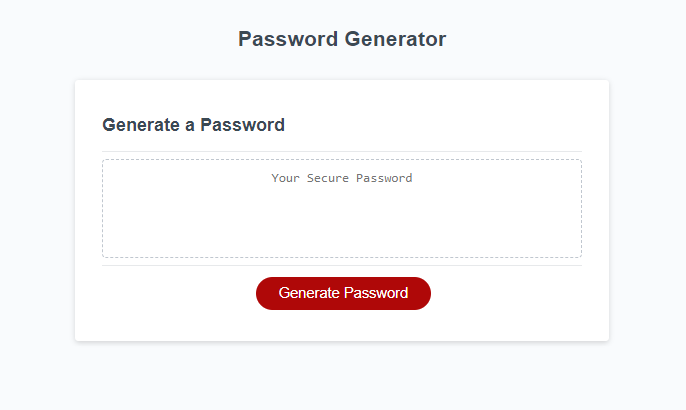
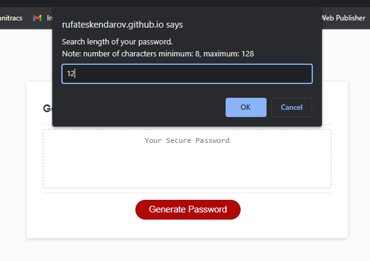
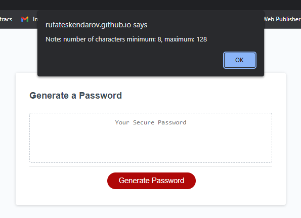
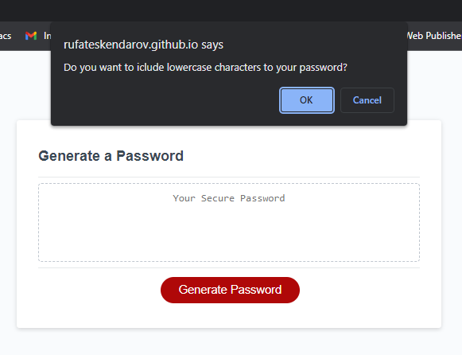
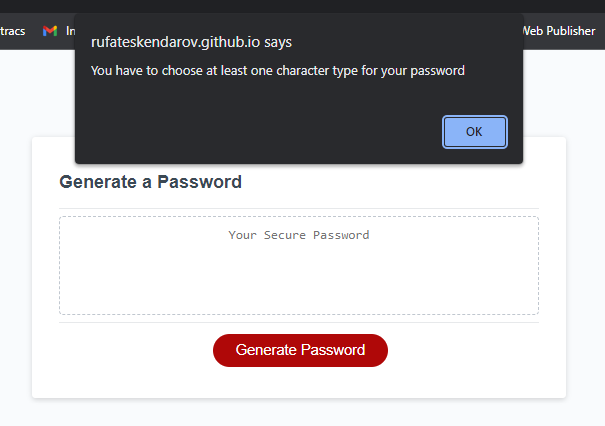
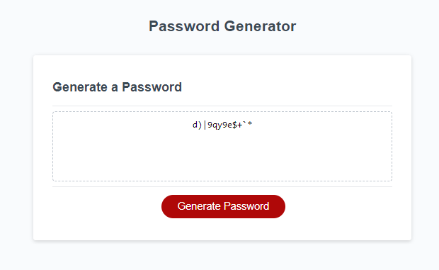

# Key-Gen

## Description

This project was created to practice the JavaScript knowledge gained during the Coding Bootcam course.

This application is able to generate a password with a length of 8 to 128 characters. The user himself can determine the length and type of characters from which it should consist.

This application is perfect for generating a complex password that is difficult to crack, perfect for protecting accounts and your computer.

While writing the code for the Key-Gen application, I learned more about such aspects of JavaScript as functions, if-else statements, their scope and their capabilities.

## Installation

This application does not require installation, just follow the link: https://rufateskendarov.github.io/key-gen/

## Usage

The application (password generation) works in several stages:

1. By clicking on the link, a window with a red button "Generate Password" will open in front of you (img-1);
2. Click on the button and a pop-up window will appear on the screen that will ask you to enter the length of the code, a minimum of 8 and a maximum of 128 characters (img-2);
3. If you enter a length that does not match the criteria, the following window will pop up with a warning about the length of the password. For a new generation, click the "Generate Password" button again (img-3);
4. In the next step, there will be 4 pop-ups asking you if you want to add a lower case, upper case, numeric or special characters to your password (img-4);
5. If you select none of the four character types, a pop-up window will appear warning you that you must select at least one type and code generation will stop. To continue, go through all steps 1 to 4 (img-5);
6. If all the steps are completed in accordance with the requirements of the program in the window above the red button, you will receive your code(img-6).

## Credits

This application was created only by my efforts.

## License

In accordance with https://choosealicense.com/licenses/gpl-3.0/

## Features

- HTML5
- CSS3
  -JavaScript

## How to Contribute

Please review my page if you have ideas or advises please contact me (rufat.eskendarov@gmail.com)

## Tests

Manual testing was carried out on the application, no errors or bugs were found. If you encounter problems while using the app, please contact me (rufat.eskendarov@gmail.com).
